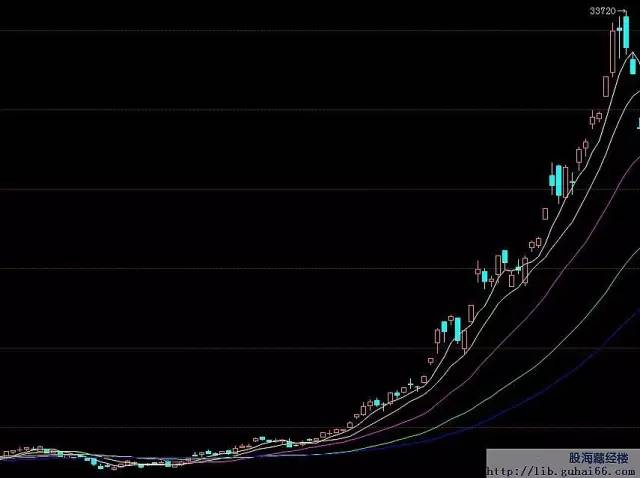
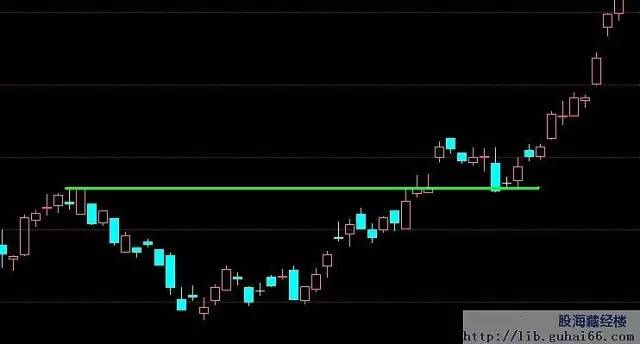
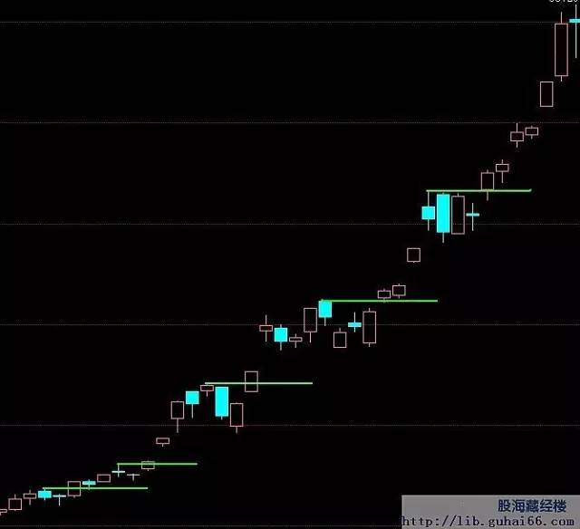
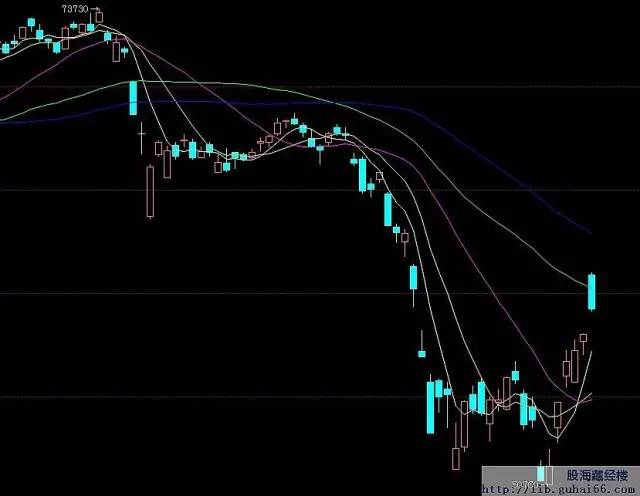
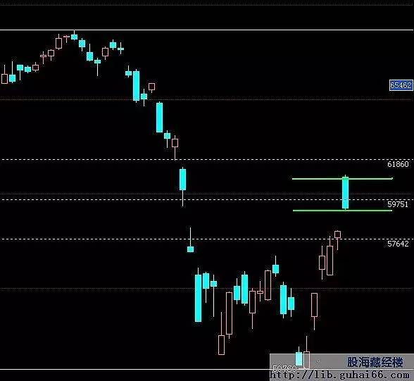
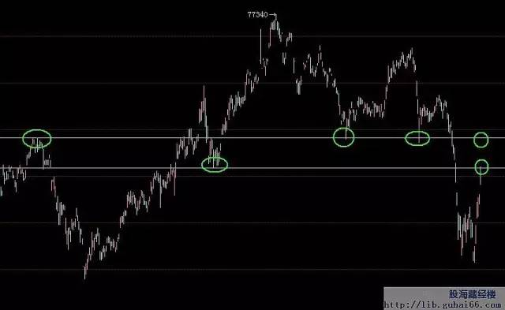
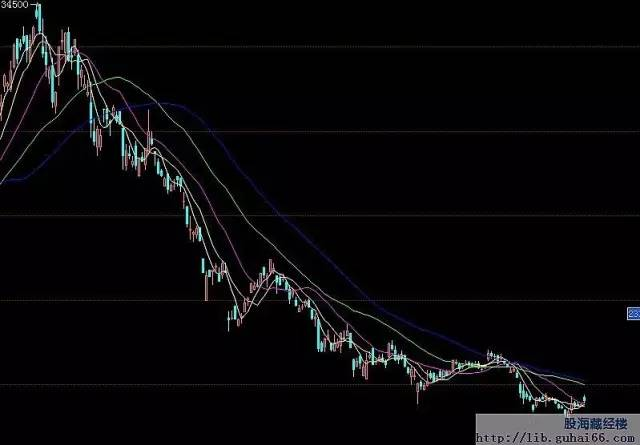
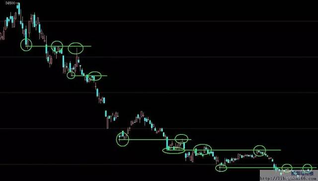

# 一个期货高手的交易思路：关于复利 

原文：https://mp.weixin.qq.com/s?__biz=MzA5NzI3MjExNA==&mid=2650655777&idx=1&sn=aea055b97196b485af79ccb34d56ee98&chksm=88aa047cbfdd8d6a5881b312453edc08663d1547d8e61e70f7c562c3bc790cbe4ea623a78e8b&scene=0#wechat_redirect

## 关于复利

在我发现复利效应这个概念之前，我曾经看到这样一道算术题：

假设你有10万的资金，你是满仓交易的，第一次很惨，你亏了50%，只剩下了5万本金，第二次你继续开仓，然后你又赚了30%，紧接着又一个天大的馅饼掉到了你的手上，你又赚了30%，我们来算算你三次开仓以后的本金结余，84500元，对，你没有看错，你对了两次，错了一次，可是结果你还亏了15500元，假设第一次操作的时候，我加一个止损，当投入市场的资金亏到20%的时候我就止损出局，那么再来看一下，我们三次操作后的资金结余，135200元，这次效果非常好，竟然赚了35200元。这只是设定了一次止损的结果，我们便扭亏为盈了。

我一直把这个故事牢记在心里，**每次当我开仓的时候，我就给自己规定一个最大的亏损幅度，以应对极端行情（比如暴涨暴跌）所带来的风险。**

说到复利效应，它有两个内涵的概念：

1、很高的正确率，保证资金可以不断的上涨；

2、当出现错误的时候，资金回撤的比例不能过大；

先强调第二点，是因为很多人被市场扫出局往往不是因为自己没有赚过，而是因为贪图暴利而在市场反向运行的时候硬抗，结果被扫出局。

你在掌握复利效应之前，就必须先把这个概念深入的印到自己的脑子里，当你开仓的时候，就该很清楚的知道，当我错了，我应该什么时候出局观望。【股海藏经楼（QQ/微信1730397054）评注：买入的前提是知道何时卖出，否则就不该买入。那些买入后到处去问别人的，就违背了这个原则，很难做好交易】

接下来，我们再解决，如何才可以有很高的正确率。我也是从新手过来的，我知道大家做期货的时候所存在的每一个心理状态。今天的行情上下起伏，我却不知道该不该下单，很迷茫，开了怕亏，亏了又死扛，盈利了又马上想抛掉，结果本金不断的缩小，不断的缩小，最后的结果就是含恨立场。

为什么会有这样的原因，因为你们只想着赚钱，而被掉下来的钞票蒙蔽了眼睛，看似我们是在期货的操作中赚钱，但其实，我告诉你，**期货里真正赚钱的，都是在停盘以后。开盘，只是验证我们的工作是否扎实，就像在学校学习一样，开盘就是考试，可是考试之前很多的学习，都是在停盘了以后。**

我们每个人都想赚大钱，可是你是否把19个品种的大波动的走势都仔细的研究过，是否总结过？是否在其中寻找到一丝的规律？如果这样问，你仍然很迷茫，那么我来问你，你能拿的出几本复盘的笔记？1本？2本？我如果让你看看我的书柜，我估计你会自惭形秽了，我有一个房间全部都是那些东西。烧都烧不完！

我们先从一个假设开始，有没有这种可能？没有人买卖，价格就可以自己上下起伏的？答案是没有，也就是说，价格的起伏是肯定需要推动力的，什么推动力？就是持仓量，就是仓差，就是成交量，当你看到今天比昨天明显有增仓的时候，当你看到持仓量也在明显增加的时候，你要给自己一个理由，为什么？主力是不会无缘无故的就去推动价格的走势的，肯定有他的理由。你是否能发现这种理由？

继续深入它，我再做一个假设。假设你就是主力，你手头有几个亿的资金，你怎么把它变成盈利的多头的头寸？你是否想过我应该让行情先跌一跌，但是不要跌的太狠，然后逐步的建仓，最后发力上攻，从而达到你的目的。对了，你这样的思考绝对没有错，因为你也知道，当你很多资金砸进盘里的时候价格会有巨幅的波动，你必须事先先让行情稳一下，或者说朝相反的方向运动一下。

可能有人会问，你怎么知道行情下跌了，就是会预备上涨呢？万一是暴跌呢？

对，是可能存在这样的问题，所以我们要来鉴别，所以我们经常听到一句话，顺势而为。

怎么去顺势而为，我教给你，看看均线，看看日线的价格是否在均线之上？是否偏离均线过多？乖离率过大？

假设最近的行情一直在均线之上，你有什么理由去做空？千万不要。坚持做多，可是行情也会下来啊，对，这会影响你的高正确率的，你怎么做？如果日内从开盘以后就一直往下走了，那么你看看日线，看看它应该回调到什么位置，看看附近是否有高点的支撑，如果有，那么你就等着，等到回调到站住了支撑的时候去做多，同时设定一个合适的止损，不要太大，因为没有意义。站住了支撑，你可以继续做多了，如果价格根本没有回调到位置，那么你继续等待，等到它要突破高点的时候进场。然后继续的做多，做多。

有人会问，我很怕留仓，怎么办？我觉得你压根没必要这么担心，你要抓住几个要点，  
#### 第一，均线之上不要做空，均线之下不要做多；  
#### 第二，不要在没有支撑，没有放量突破的时候跟单，因为第二天行情的走向谁也说不准；  
#### 第三，你仔细的对比昨天的持仓量，仓差和成交量，今天的上涨是否同时伴随着持仓量的上升，是否伴随着增仓，是否成交量在放大？  
#### 第四，不要在偏离价格运行轨道很远的地方开仓，有很多人喜欢在今天收盘快要涨停的时候留一些多单，我从来不这么做，因为在涨停之前的好几天，我已经有了合适的仓位了。

我用去年的棉花给大家看一下

我再画出几个比较不错的入场点，大家参考一下

大家可能觉得，我拿着过去的行情，当然怎么说都是对的，那么我们就说说未来的事情，看看最近的铜吧！

我们先看CU1201，看看我们应该选择什么样的方向？

你看的没错，价格运行在均线的下方，所以我是不会去做多的，再看看回撤的比例，是否有可能建仓的地方？

看起来还不错，在45%-55%的回调区域（就是绿线标准的区域），铜高开低走了，所以我的选择就是，如果周一的价格是在今天的价格区域之内开盘的话，我会在下破了低点的位置建仓，同时设一个合适的止损，如果价格跳空高开，我就观望。如果行情跳空低开的幅度不大，那么我先10%轻仓跟一下，若价格反涨，我就在价格反涨到昨日的收盘价（也就是跳空缺口回补的地方）的地方，增仓到20%，为什么仓位不重？因为最近行情波动的幅度很大，我不太希望在这个时候去博弈。这对我不利，我宁可在开仓了以后的第二天，确定有盈利了再适度加仓，也不会在这个位置赌博。

如果行情跟我们预想的不一样，继续上涨，那么我们找一下最近的，不错的支撑阻力位，看看有什么发现？

结果还不错，我发现几个低点的阻力位，今天的价格就是在最近的一个阻力位开盘并且遇阻向下的，如果我是今天选择尝试做空的话，已经收益颇丰了。

行情继续上涨，我在下一个阻力位做空，直到什么时候，直到价格重新回到了均线之上的时候，我才会考虑转变方向。我坚持我的看法，而不受外盘或者其他信息的左右，坚持自己的思路。

那么我在什么时候止盈，如何止盈呢？记住，这是经验，而不是技术。**止盈从来都是经验，不是技术。**是对行情节奏的一种把握，下降的速度很快的时候，我用快速的均线，比如10日均线，行情下降的速度比较慢的时候，我用慢速的均线，或者我浮动止盈，行情顺开仓方向运行，我就给行情预留一个回调的空间幅度，然后在其之上设一个止盈，行情继续向下，继续调低止盈，就这样，并不复杂，如果有支撑阻力位伴随着，那更好了。

大家看到我说这些，似乎感觉偏离了题目，我在讲的是复利效应当中，如何提高正确率的问题，为什么又讲到开仓上去了？

其实道理很简单，提高正确率，就是注意下面几个要点：

#### 1、均线之上不做空，均线之下不做多；
#### 2、不要在偏离均线很远的位置开仓；
#### 3、不要在没有支撑阻力位的地方或者不到回调幅度的地方开仓；
#### 4、顺势而为；

看看我在棉花上取得的成果吧！

现在你来仔细的数数，看看正确率到底有多高？心里有底了吗？

继续领悟和钻研吧，这个市场并不难，记住我说的一句话，开盘只是考试，验证你在停盘以后的学习成果。所以，线下的时候多学习，多钻研，就是王道。

（来源：网络转载）