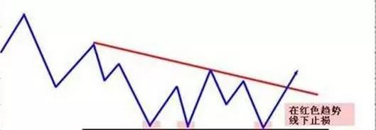
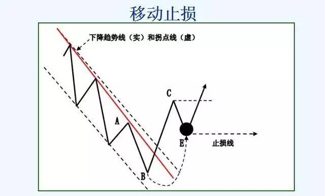
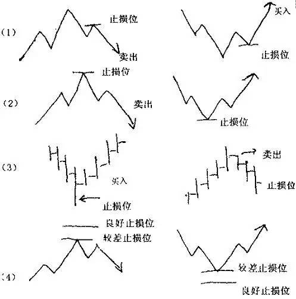

# 对于止损的另类而犀利的解释 

原文：https://mp.weixin.qq.com/s/h7kHyMJNSIqbrdNpGa8MOQ

2017-01-03 网络转载 股海藏经楼

人的一生，很多时间都在开锁，而身上的这把钥匙往往就决定了你的人生。试着用心去修炼身上的这把钥匙，让它为你的选择提供更多的支撑。糊涂的人，将智慧深埋于心中，面对过于复杂的世事，简单做人、简单做事，逢人不急，遇事不恼，用难得糊涂的随遇而安，酿造生活的醇厚佳酿。

趋势交易，大行情才有大利润。过去的自己天天就想着大行情，上突破就觉得价格要翻倍，下突破就觉得市场要崩盘。其实真正的行情1年1波都不一定有。系统都要按照最坏的情况来设计，如果你能顶过去，才是合格的。交易需要务实的精神，敢放胆盈（让利润自己跑），更要善输（小周期止损 移至成本）。我认为只有做到这两点，才算真正的入门。才能够谈心态，谈纪律。

图比较直观：假设小周期做多（红点为右侧交易点），30点蓝线止损。
1. 入场后直接打止损，最坏的情况没话说。
2. 入场后浮动盈利30点 ，盈利和止损1：1，可以考虑止损移至成本。
3. 入场后下一个调整继续上升，可以考虑止损移至成本或新的低点。

想再强调的是：

（1）无序的震荡可能会连续地把你止损出去，市场根本就不尊重我们，所以迅速移至成本非常地重要。

（2）设计和优化系统一定从最坏的情况来考虑，不要老想着怎么多赚。赔的少自然就多赚了。 交易之路是很孤独而漫长的。

笔者是这样理解震荡的：在当前周期比如说4小时周期，有趋势市和震荡市，而当前周期的震荡市就是小周期的趋势市，4小时中的震荡市或许在小时图和30分钟图上有明显的趋势...我们可以把注意力转到小周期上面... 当然更小的周期15分钟，5分钟图也有趋势，但这和4小时图的联系就太小了。我们关注和当前周期相差4-6倍的周期就行了....

以日线做多举例：
1. 交易系统日线发出做多信号
2. H1等待回档后右侧做多（H4也可，各人系统不同），设损。
3. 行情展开后，止损上移止成本。--- 小周期入场工作结束。
4. 回到日线---大周期出场。如果此后日线确实趋势上升的话，在日线上移动止损（我是每个日线的最低点，你也可以用50%的最高利润或其他方法等等，只要按照自己的习惯和系统的特性而定，但一定要是在日线上移损）。
5. 随着止损的不断上移，市场最终行情结束---大周期出场工作结束。（大趋势止损移动多，小行情移动少。震荡的话可能反复的止损或0利润。）
6. 若碰了损后日线仍判断为上升趋势，还可以在H1/H4入多单。直到判断日线转势，下一个循环。

看大一级周期的支撑/阻力位逐步跟随推保护，也是大周期移损。小周期移损是为了资金安全，为了少亏。而大周期移损则是尊重市场，放胆去赢。每个人大周期移损的方法不同，支撑移损，盈利50%回撤移损，等等都可以。关键是我们的理念是一致的。

胜率和赔率是一对永远的矛盾。比如日周期出场，H1/H4周期入场，这样的话就保证了赔率（也就是盈亏比），同时胜率也在一个可以接受的范围内(40%~50%左右）。但如果日线出场，而用5分钟入场的话，赔率是有了更高的保证，但是成功率大大降低，可能只有10%甚至更低。如何掌握交易中胜率和赔率和平衡非常的重要，每个人的心理承受能力也不尽相同。掌握好自己交易的“度”是关键！

（转自新浪博客）

